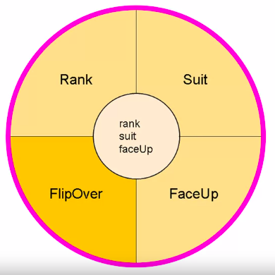

# Creating a new project in Unity

1. In the Unity UI, we can go to the `Projects` tab
2. Click the "New project" button
3. We will create 2D games for now. Click on "2D Core"
4. Name the project
5. Set the project location
6. Once the Unity project is open, right-click the "Assets" tab in the "Project" section of the UI and create a new folder for scripts called "Scripts"
7. To change the external script editor in Unity, you will need to open `Edit -> Preferences -> External tools` and then in "External Script Editor", locate your editor executable binary file. In my case I'm using VSCODE installed as a Flatpak, so I had to locate the binary file running:

```
flatpak info --show-location com.visualstudio.code
```

# Programing Assignment 2

I will have to calculate the velocity vector based on some coordinates using the pythagorean theorem, which states:

$c^2 = a^2 + b^2$

If I take the square root of $a^2 + b^2$ I get $c$

It was easy to do this, the only problem I had was with type casting (bad habits from Python). The solution is detailed below:

```cs
// First just calculate the squared delta from the X and Y coordinates
float squaredDeltaX = (float)Math.Pow((point2X-point1X),2);
float squaredDeltaY = (float)Math.Pow((point2Y-point1Y),2);

// Then calculate the distance using the pythagorean theorem 
float distance = (float)Math.Sqrt(squaredDeltaY+squaredDeltaX);

// Then calculate the angle (in radians) using Atan2 
float radians  = (float)Math.Atan2((point2Y-point1Y), (point2X-point1X));

// Convert radians to degrees
float degreesFromRadians = radians * (float)(180 / Math.PI);

// Print the result the way the instruction says (distance -> single space -> angle)
Console.WriteLine(distance + " " + degreesFromRadians);
```

# How to use classes and objects in game development

They can be used to capture a state, behavior, identity, and so on. A good way to represent these ideas is to visually depict the "place" of all object-oriented contexts for a given object:



Reference: [C# Programming for Unity Game Development Specialization](https://www.coursera.org/specializations/programming-unity-game-development)

We can also use UML to represent stuff (classes and objects) in the game development world. 

In Unity, when we create a script, we are creating a class. We can then attach said class to a game object; if we do, that game object get an instance of that class. 

# Sprites and game objects

Sprite are graphical assets and can be:
- A simple frame
- A set of frames, also called sprite sheets (animation)

Game objects are entities included in the scenes. 

To add a sprite to a Unity project:
1. It is better to first create a folder called "Sprites" inside the "Assets" directory
2. Once you have created that folder, we can simply drag and drop image files to it (`.png` most of the time)

To add that sprite as a game object, we can simply drag the image in the "Project" tab to the "Hierarchy" tab, inside some scene.

A good tip when trying to find the right size for a sprite is to never actually change the size of the sprite (X, Y, and Z), beucase it will mess up the image quality and also some aspects of the game object. What we want to do is change the "Size" of the camera, decreasing it to increase the size of the sprite or increasing it to decrease the size of the sprite.

Another great tip is to always make the dimensions of a sprite or texture a power of 2 because of graphics card efficiency.

# Scripts as components

A cool exercise is adding a script to a game object, which is a sprite. A good tip here is when we create a new script in the Unity UI, and we decide to change it's name, it is necessary to also open the script and change the class name, because it will have the same name the file had when it was created.

Another good tip is when you attach a script to a game object while running the game, you will see the result of that script, but as soons as you stop the game, you will see that the script is no longer attached to that game object. That's because Unity understands you were just debugging stuff in the previous run sessions. To make that action permanent, you need to attach the script to a game object while the game is not running.

# Debugging a Unity script using Unity and VS-Code

1. Inside VS-Code, we can start a debugging section placing a breakpoint where you want it
2. Find the Attatch do Unity button

